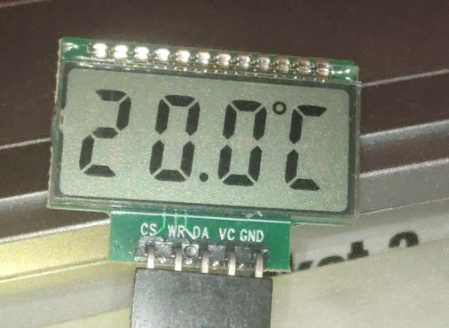
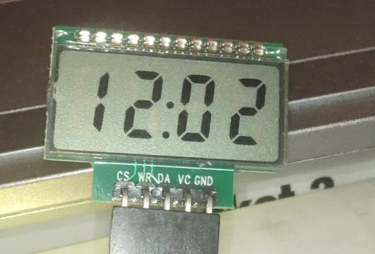

# HT1621 Small LCD

## Deprecated Use SegLCDLib instead

https://github.com/petrkr/SegLCDLib

## For history purpose only

This is child driver based on HT1621 with replaced update and charset for 4-digit LCD display from Aliexpress.

https://www.aliexpress.com/item/1435066364.html

Prerequest for HT1621 parent driver is make private functions as protected, so they can be used in this child class. And mark `update` and `charToSegBits` functions as virtual, so they can be overriden by this library.

 

